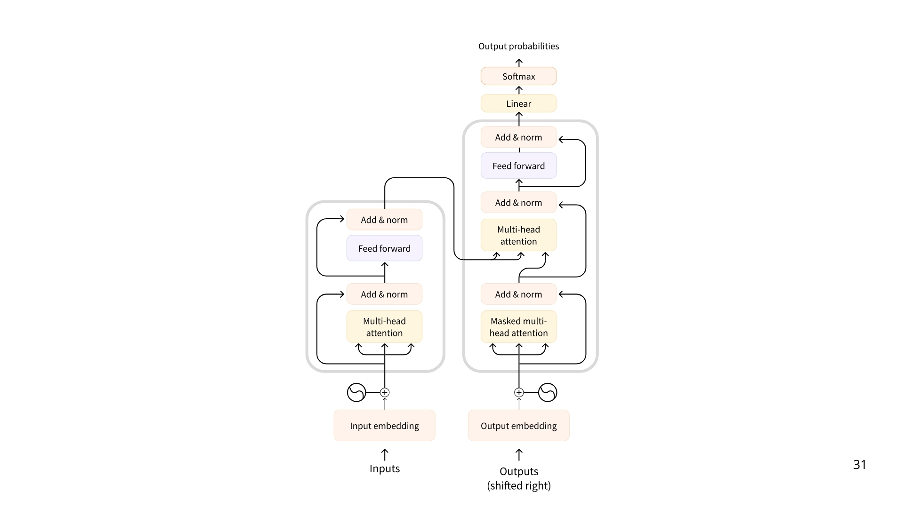

# What is a Large Language Model?
An LLM is a type of AI model that excels at understanding and generating human language. LLMs are built on Transformer architecture.

Original Transformer Architecture:

There are three types of transformers:
1. Encoders
    An encoder-based Transformer takes text (or other data) as input and outputs a dense representation (or embedding) of that text.
    - Example: BERT from Google
    - Use Cases: Text classification, semantic search, Named Entity Recognition
    - Typical Size: Millions of parameters

2. Decoders
    A decoder-based Transformer focuses on generating new tokens to complete a sequence, one token at a time.

    - Example: Llama from Meta
    - Use Cases: Text generation, chatbots, code generation
    - Typical Size: Billions (in the US sense, i.e., 10^9) of parameters

3. Seq2Seq(Encoder - Decoder)
    A sequence-to-sequence Transformer combines an encoder and a decoder. The encoder first processes the input sequence into a context representation, then the decoder generates an output sequence.

    - Example: T5, BART
    - Use Cases: Translation, Summarisation, Paraphrasing
    - Typical Size: Millions of parameters

The underlying principle of an LLM is simple yet effective: its objective is to predict the next token, given a sequence of previous tokens.

# How can I use LLMs?
There are two main options:
1. Run locally 
2. Use Cloud/API

## How are LLMs used in AI Agents?

LLMs are a key component of AI Agents, providing the foundation for understanding and generating human language.

They can interpret user instructions, maintain context in conversations, define a plan and decide which tools to use.
